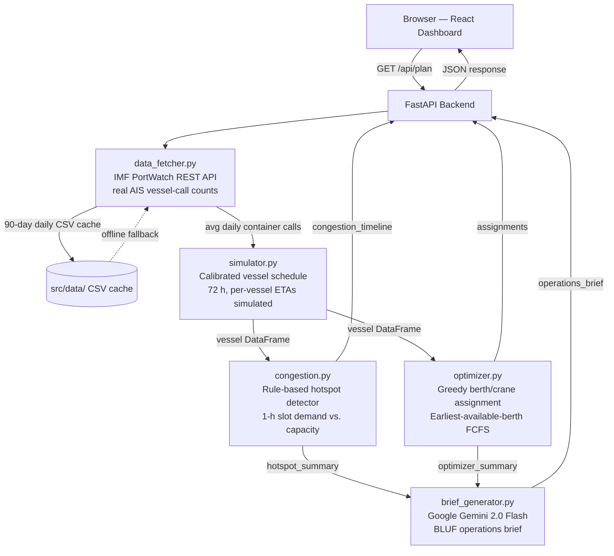

# Architecture

## System Diagram



---

## Component Table

| Component | File | Technology | Responsibility |
|---|---|---|---|
| REST API server | `src/backend/main.py` | FastAPI (Python) | HTTP routing, response serialisation, CORS |
| PortWatch client | `src/backend/data_fetcher.py` | requests, pandas | Live IMF PortWatch API fetch + 24-h CSV cache |
| Vessel schedule simulator | `src/backend/simulator.py` | Python, random | Calibrated per-vessel ETA generation (simulated) |
| Congestion detector | `src/backend/congestion.py` | pandas | 1-h slot demand counting, hotspot severity flagging |
| Berth/crane optimiser | `src/backend/optimizer.py` | Python | Greedy earliest-available-berth assignment |
| Brief generator | `src/backend/brief_generator.py` | httpx, Google Gemini API | BLUF operations brief, rule-based fallback |
| Dashboard | `src/frontend/src/App.jsx` | React, Vite | Port selector, plan trigger, layout |
| Congestion chart | `src/frontend/src/components/CongestionTimeline.jsx` | Recharts | Colour-coded 72-h demand bar chart |
| Assignment table | `src/frontend/src/components/AssignmentTable.jsx` | React | Filterable/sortable vessel schedule table |
| Operations brief | `src/frontend/src/components/OperationsBrief.jsx` | React | Formatted AI-generated brief panel |
| Meta banner | `src/frontend/src/components/MetaBanner.jsx` | React | Plan metadata strip (port, start, data source) |

---

## Data Flow Detail

```
IMF PortWatch API
  └─► portcalls_container (real, daily aggregate, AIS-based)
        └─► 14-day rolling average → avg_daily_calls
              └─► simulate N×3 vessels over 72 h (bimodal ETA distribution)
                    ├─► congestion_timeline[72 slots]: demand, capacity, severity
                    │     └─► hotspot_summary: peak demand, window list
                    └─► assignments[N rows]: berth, crane_count, start, end, wait
                          └─► optimizer_summary: avg_wait, rerouted count

hotspot_summary + optimizer_summary
  └─► Gemini prompt (structured, no hallucination anchor)
        └─► operations_brief (plain-language BLUF brief)

All three outputs → /api/plan JSON → React dashboard
```

---

## Technology Decisions

| Decision | Rationale |
|---|---|
| FastAPI over Flask | Native async, auto OpenAPI docs, Pydantic serialisation |
| Recharts over D3 | React-native, no SVG boilerplate, sufficient for bar/line charts |
| Google Gemini (free tier) over watsonx.ai | No IBM Cloud billing account available during hackathon; Gemini free tier is sufficient for brief generation |
| Rule-based congestion over ML model | Fully explainable to judges and port supervisors; no training data required |
| Greedy FCFS over MIP | O(V×B), deterministic, runs in milliseconds; MIP would need OR-Tools and solve time |
| IMF PortWatch over synthetic data | Honest data lineage; real AIS aggregate anchors the simulation credibly |

---

## IBM Bob Integration Note

This project was built **entirely inside IBM Bob** (the AI coding agent platform). Every source file — Python backend modules, React components, configuration files, and all documentation — was generated, iterated, and refined through Bob. Bob is the development platform; it is load-bearing, not decorative.

The app's generative-language feature (operations brief) runs on **Google Gemini's free tier** due to hackathon time and budget constraints on watsonx.ai access. This substitution is intentional and documented transparently.

---

## Deployment Architecture

```
Vercel (frontend, free Hobby tier)
  └─► React static build
  └─► VITE_API_URL → Render backend URL

Render (backend, free Web Service)
  └─► uvicorn src.backend.main:app
  └─► GEMINI_API_KEY set in Render dashboard (never committed)
  └─► CORS_ORIGINS set to Vercel domain
```

**Cold-start caveat**: Render free services spin down after 15 minutes of inactivity. First request after idle takes ~30–60 s. Hit the `/health` endpoint once before recording the demo video or sharing the live link.

---

## Scalability Notes

- The current design is stateless — each `/api/plan` call fetches and computes from scratch. For production, add: a scheduled job to pre-fetch PortWatch data every 6 hours, a Redis cache for plan results, and a queue (Celery/ARQ) for long-running plan computations.
- The greedy optimiser handles ~100 vessels in < 50 ms. For 500+ vessels, a MIP solver (OR-Tools) is the natural upgrade path with no architecture changes required.
- CORS is currently `allow_origins=["*"]` for development ease. Tighten to the Vercel domain before any production use.
